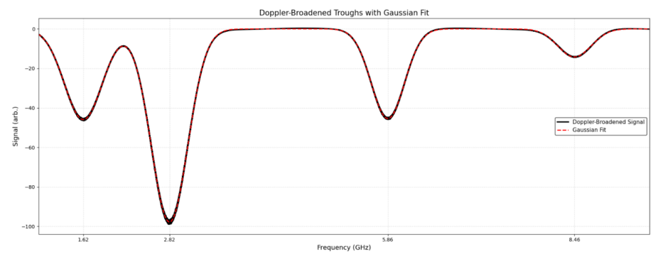
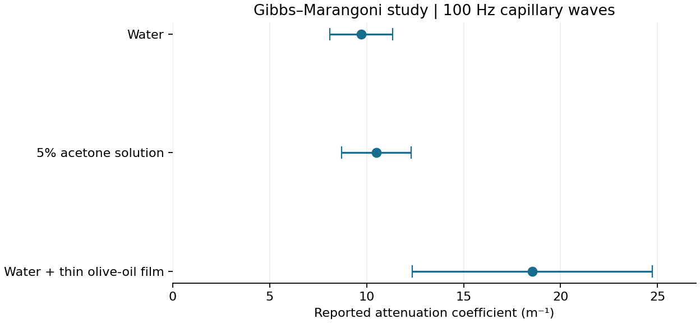

# Robert Gardner

I'm a physics graduate from the **University of Birmingham** with interests in scientific computing, experimental data analysis and numerical modelling. My work combines physical models with experimental measurements, simulation and optimisation.

## Selected projects

### [Nanophysics Group Project](https://github.com/Robert-Study/Rotating-Compensator-Ellipsometry)

I led an **eight-person experimental project** investigating thin films and surface plasmon resonance. My main contribution was the rotating-compensator ellipsometry analysis, including the extraction of Ψ and Δ, instrument calibration and estimation of film properties.

My improved experimental setup and analysis tracked Ψ and Δ approximately **25× more closely than previous-year implementations**. I also developed a new calibration technique that reduced the remaining tracking error by a **further factor of two**. This enabled the measurement of nanometre-scale silicon-oxide films: **55 ± 7 nm**, compared with the certified value of **53.30 nm**.

**71% group mark · 75% individual mark | First Class.** [Read the project report](https://1drv.ms/b/c/4a8cd531de3d2eb8/IQDELQqEGltQTbL7tnMde-ugARVe41tXLblHZuhFeltOyTY?e=aEIhof).

### [Forest Fire Simulation](https://github.com/Robert-Study/Forest-Fire-Analysis)

A stochastic forest-fire model used to study population oscillations, fire-size distributions and cluster geometry. I expanded the original coursework with larger simulations, parameter sweeps, event tracking and an [interactive online simulation](https://forest-fire-analysis.streamlit.app/).

I optimised the model to handle **2 trillion+ cell-time updates per large simulation**, with **15 trillion+ across the project**.

**74% | First Class.** [Read the project report](https://1drv.ms/b/c/4a8cd531de3d2eb8/IQDim1tykc0nTKl1fFVf2T52AaR-wLgcwbBSEvPdq3rfR-U?e=Kbm6k0).

### [Scientific Python Projects](https://github.com/Robert-Study/Scientific-Python-Projects)

Computational-physics coursework covering quantum systems, Fourier analysis, signal filtering and rocket control, alongside six scientific-programming worksheets.

**Quantum systems: 95%. Self-landing rockets: 90%, highest in the cohort. Spectral analysis: 80%. Programming worksheets: 98% average, highest in the cohort.**

### [Binary Search Tree Optimisation](https://github.com/Robert-Study/Binary-Search-Tree-Optimisation)

An optimisation study examining how root selection affects the expected reward of each key in a binary search tree. The code is tailored to a 100-key model in which rewards decrease with search depth. The current solution uses roots in the range **4–82** and gives every key a positive expected reward.

I intend to explore alternative tree constructions that could improve the root-range and reward trade-off further.

## Experimental work

### Atomic Physics Laboratory

**Doppler-free laser spectroscopy on rubidium · 77% | First Class**

[Read the Atomic Physics Laboratory report](https://1drv.ms/b/c/4a8cd531de3d2eb8/IQCydZCXEyXXRYGX54IusWuyAX9yCW92tuoZgfGBUgo1yqQ?e=XzBLd3)

The experiment used saturated-absorption spectroscopy to resolve hyperfine features in the rubidium D₂ transition near 780 nm. Counter-propagating pump and probe beams reduced Doppler broadening, while a Fabry–Pérot cavity provided a frequency reference for the laser sweep.

**Analysis**

I converted the recorded time axis into frequency, fitted Gaussian profiles to the Doppler-broadened features and Lorentzian profiles to the Doppler-free resonances, then used the fitted separations to estimate hyperfine coupling constants.

*The Gaussian fitting stage from Figure 5 of the report.*

| Reported quantity | Estimate |
| --- | ---: |
| ⁸⁵Rb ground-state magnetic-dipole constant | 1005.7 ± 15.1 MHz |
| ⁸⁷Rb ground-state magnetic-dipole constant | 3416.1 ± 5.1 MHz |
| ⁸⁵Rb excited-state magnetic-dipole constant | 25.9 ± 1.3 MHz |
| ⁸⁷Rb excited-state magnetic-dipole constant | 86.7 ± 2.7 MHz |
| ⁸⁵Rb excited-state electric-quadrupole constant | 28.4 ± 2.8 MHz |
| ⁸⁷Rb excited-state electric-quadrupole constant | 14.6 ± 2.9 MHz |

The report compares these estimates with literature values and examines departures from a linear laser-frequency sweep. It reports a sweep nonlinearity estimate of approximately **1.5 ± 0.3%**.

**What I would carry into a further experiment**

The precision returned by a curve fit is only one part of the uncertainty. Frequency calibration, beam alignment and power broadening can affect the extracted parameters even when a fitted waveform looks convincing. A fuller analysis would propagate calibration uncertainty jointly with the resonance-fit covariance and distinguish statistical from systematic contributions.

This page summarises the original report. The raw oscilloscope records and the full analysis code are not included here, so these values are reported experimental results rather than a newly reproduced benchmark. The report credits the laboratory partner separately.

### Gibbs–Marangoni Effect: Summer Research Project

**Capillary-wave attenuation measured with laser interferometry**

[Read the Gibbs–Marangoni Effect Summer Research Project report](https://1drv.ms/b/c/4a8cd531de3d2eb8/IQB8Hye49FXSR7A0i2hvo-G8Ab0BsuLALmtz2v9vtYWGD7U?e=uABOP4)

This summer project investigated how a thin surface film changes the decay of capillary waves. I used laser interferometry to measure wave motion at different distances from the source and fitted the amplitude decay in Python.

The analysis included correcting laser-intensity fluctuations, modelling the detector response, fitting wave motion and estimating attenuation with uncertainty-weighted fits.

**Reported results at 100 Hz**

| Sample | Attenuation coefficient |
| --- | ---: |
| Water | 9.72 ± 1.61 m⁻¹ |
| 5% acetone solution | 10.51 ± 1.79 m⁻¹ |
| Water with a thin olive-oil film | 18.54 ± 6.19 m⁻¹ |

*Plot reconstructed from the report's summary values. Error bars show the quoted uncertainties; they are not newly estimated confidence intervals.*

The oil-covered sample's point estimate is approximately **91% higher** than that for water. The uncertainty is substantial, however, so that percentage should not be read as a precise measurement of a separate damping mechanism.

**Interpretation and limits**

The observations suggest increased attenuation in the presence of a surface film, consistent with the motivation for investigating Gibbs–Marangoni damping. The experiment did not directly measure surface tension with a tensiometer or establish a precisely controlled monolayer. It therefore could not cleanly separate the contributions of surface elasticity, surface tension and other experimental effects.

A useful follow-up would combine controlled surfactant coverage with independent surface-tension measurements and repeat the attenuation experiment across several frequencies. That would make the physical interpretation less dependent on assumptions about the liquid surface.

The linked report documents the original experiment and acknowledges the supervision and laboratory support. Raw time traces are not included here; the figure above is a transparent summary of reported estimates, not a reanalysis of those traces.

**Main tools:** Python, NumPy, SciPy, Matplotlib, pandas, Streamlit, Git and LaTeX.

**Email:** [home@robertgardner.co.uk](mailto:home@robertgardner.co.uk)
